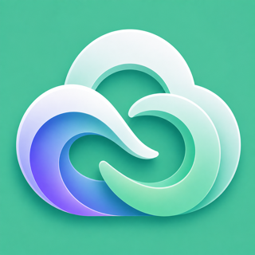

<div align="center">



# Caelo

**Paste a link. It works.**

A VPN client for subscription links, for people who should not have to learn what a
protocol is.

[](https://github.com/TeamGDB/Caelo/actions/workflows/flutter.yml)
[](https://github.com/TeamGDB/Caelo/actions/workflows/core.yml)
[](LICENSE)
[](#platforms)
[](#protocols)

**English** · [Русский](README.ru.md)

</div>

---

> **Early development.** The tunnel works. Nothing else is finished, and there are no
> releases yet.

## What it is

No accounts. No ads. No telemetry. Free software under the GPLv3.

Caelo speaks [AmneziaWG](https://docs.amnezia.org/documentation/amnezia-wg/) with the full
obfuscation parameter set — junk packets, magic header ranges, and AWG 2.0 signature
packets that make a handshake look like DNS, QUIC or SIP. Which of them you end up using
is not a question the app asks you.

The main screen is a button, a word, and one line of small text saying what you got.
Settings exist for the cases the automatic choice cannot cover, and you should never need
to open them.

## Protocols

| | |
| --- | --- |
| **AmneziaWG** | `Jc` `Jmin` `Jmax` · `S1`–`S4` · `H1`–`H4` · `I1`–`I5` |
| **VLESS / REALITY** | via sing-box |
| Everything else sing-box speaks | comes along for the ride; not a goal |

## Platforms

| Platform | Tunnel | Covers |
| --- | --- | --- |
| **macOS** | NetworkExtension system extension | the whole machine |
| **Android** | `VpnService` | the whole device |
| **iOS** | NetworkExtension packet tunnel | the whole device |
| **Linux** | privileged service from the deb or rpm; in-process otherwise | the whole machine, or this process |
| **Windows** | — | interface only |

## Architecture

The core knows about configurations, not about subscriptions. It can say what is in one,
whether it carries traffic, and raise it — one at a time. Everything that makes a
subscription a subscription is delivery: a link, an HTTP request, a refresh interval, a
cached copy of the last one that worked, a remaining-traffic header, several sources merged
into a list. None of that is executed by a tunnel, and all of it is what the user sees and
edits, so it lives in Flutter.

The rule that does not move is connection state. That exists in exactly one place, because
state kept in two will eventually disagree with itself about what is connected.

Nodes are tried in the order the server gives them. Measurement is available where it
helps — `caelo_probe` answers whether a configuration really carries traffic, on a
userspace stack, without touching the machine's networking or a tunnel already up — but
the order is the server's, not something the client recomputes.

**Caelo will fork nothing.** [sing-box](https://github.com/SagerNet/sing-box) is to be
imported as an ordinary Go module, with the core registering its own `amneziawg` endpoint
through its public registry — that is what makes an AmneziaWG node expressible in the same
document as everything else. It is not a dependency yet: nothing imports it, and a version
pinned for a build that does not use it records an intention rather than a fact. AmneziaWG comes from
[amneziawg-go](https://github.com/amnezia-vpn/amneziawg-go), also as published. Both are
upgraded by bumping a version; there is no patch series to rebase.

The alternative was forking `sagernet/wireguard-go` and porting the obfuscation into it.
Measured against their common upstream, that fork and `amneziawg-go` have diverged by
comparable amounts — roughly 1700 and 1800 substantive lines — so reconciling them is real
work in either direction, and work we would redo on every AmneziaWG release. AmneziaWG is
the reason this project exists, so it is the dependency that stays fresh.

| Path | What it holds |
| --- | --- |
| [`lib/`](lib) | The interface. Flutter, Cupertino, one look everywhere. |
| [`core/`](core) | The Go core: the tunnel, the probe, state. |
| [`packaging/`](packaging) | Turning a build into something installable. |
| [`scripts/`](scripts) | One build script per platform. |

Pinned: amneziawg-go `v3.0.20260805`. Intended: sing-box `v1.13.16`.

## Building

Each script builds the core first, puts it where that platform's loader will find it, and
then builds the app.

```bash
./scripts/build-macos.sh debug     # universal dylib in Contents/Frameworks
./scripts/build-android.sh debug   # one .so per ABI, packed into the APK
./scripts/build-ios.sh release     # static xcframework linked into the binary
./scripts/build-linux.sh debug     # .so in the bundle's lib/
./scripts/build-windows.sh debug   # .dll beside the executable
```

Android needs an NDK; the script finds one under the SDK Flutter already knows about. iOS
debug builds use a JIT and will not launch without the tooling attached, so release is the
default there.

Any of them can be run without a core — `flutter build <platform>` still builds the
interface. The app then says the core is missing rather than pretending otherwise.

### Trying the tunnel without the app

```bash
cd core && go run ./cmd/caelo-probe -config /path/to/tunnel.conf
```

Brings up one tunnel on a userspace stack and fetches a URL through it. No privileges, no
interface on the host, nothing outside the process routed. If the address it prints is the
endpoint's rather than yours, it worked.

## Packaging

| Platform | Formats |
| --- | --- |
| Android | one APK per ABI, a universal APK for sideloading, and an `.aab` |
| Linux | `.deb`, `.rpm`, AppImage, `.tar.gz` |
| macOS | `.dmg`, `.pkg` |
| Windows | installer, portable `.zip` |

Four Linux formats because "Linux" is not one thing. Nothing produced is signed or
notarised yet, and an unsigned build must never be handed to anyone as a release.

## Contributing

[CONTRIBUTING.md](CONTRIBUTING.md). Sign your commits off (`git commit -s`), and never
paste a real subscription link, key or server address into an issue.

Found a vulnerability? [SECURITY.md](SECURITY.md) — not a public issue.

## License

GPL-3.0-or-later. See [LICENSE](LICENSE).

Caelo builds on [sing-box](https://github.com/SagerNet/sing-box) and
[AmneziaWG](https://github.com/amnezia-vpn/amneziawg-go); see
[ATTRIBUTION.md](ATTRIBUTION.md) for what came from where. Neither project endorses Caelo
or is affiliated with it.
